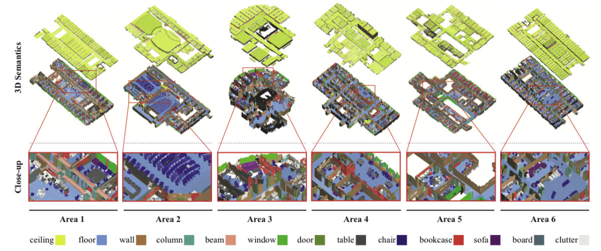
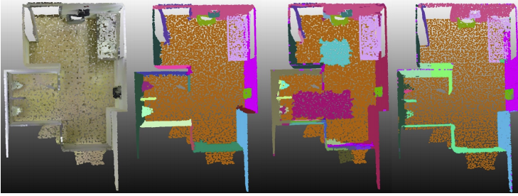
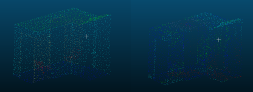

# CS7641 Project Proposal

## 3D Data Clustering and Segmentation for Indoor Environment

<h1 align="center">
 
</h1>

Figure 1. Example of point cloud processing result from [8]

## Team members
Kaylah Facey, Madison Manley, Seongyong Kim, Yosuke Yajima

## Introduction & Background
With the advancement of sensor technology, there is an explosion of 3D data, called point clouds, that is captured using 3D depth cameras and LiDAR sensors. Point clouds are useful in diverse applications including self-driving cars, surveys of infrastructure monitoring, and indoor mappings for buildings. Compared to research in 2D images, processing 3D data is a relatively new technology that uses machine learning to classify and detect objects. Using 3D data is advantageous as it is difficult, slow, and error prone to reconstruct 3D spaces using 2D images.

## Problem Statement
In civil engineering, point clouds are being used to create indoor mapping building models, as this method is significantly faster and more accurate compared to creating models by hand. However, once a point cloud is collected using LiDAR or 3D depth cameras, it takes a considerable amount of time and labor intensive work to process the point clouds into a usable model. Automating point cloud processing and reducing the processing time is very critical for applications that require point clouds to be processed immediately. In this project, we want to demonstrate how machine learning can be used to automate and improve point-cloud processing time.

## Methods

### Dataset
We plan to use the S3DIS dataset which contains 3D room scenes for semantic segmentation[3]. It contains point clouds of 276 rooms in 6 buildings, where each point is labeled in one of the 13 categories (wall, chair, table etc.). 
<h1 align="center">
 
</h1>

Figure 2. S3DIS dataset [3]

### 1. Point Cloud Clustering via Unsupervised Learning
We plan to use an unsupervised learning approach for the point cloud clustering task that subdivides a large point cloud into smaller chunks with cohesive units. The clustering results of the instance objects will be used for subsequent processing to supplement the semantic segmentation [4, 5]. As a starting point, we will ensemble the clustering results of multiple methods like gaussian mixture model and density-based spatial clustering of applications. 

### 2. Point Cloud Semantic Segmentation via Supervised Learning 
Supervised learning will be used to classify different types of objects. We plan to adapt the graph based deep learning method Dynamic Graph CNN (DGCNN) and PointNet to classify objects in a building dataset. PointNet will first be used to detect and remove large objects such as floors, ceilings, and walls from the building dataset. Following this, we will use DGCNN to detect small objects inside the building to learn more about point features.

As deep learning for 3D point cloud classification is an active research area, we want to compare DGCNN with conventional methods [8]. Therefore, as a point of comparison, we also plan to evaluate models using Random Forest.

## Evaluation & Potential Results
By integrating both methods of clustering and semantic segmentation in a complement way, we aim to perform the point cloud instance segmenation.

### 1. Point Cloud Clustering
Our proposed method will be evaluated using the common clustering matrics of Normalized Mutual Information, Adjusted Mutual Information, and Adjusted Rand Index, and be compared with other state-of-the-art results on S3DIS.
<h1 align="center">
 
</h1>

Figure 3. Point cloud clustering samples extracted from [9]

### 2. Point Cloud Semantic Segmentation
To evaluate the performance of our classification tasks, we will use six metrics to compare all methods: accuracy, precision, recall, F-1 score, mIoU, and mean average precision. A visual representation in point cloud data format will also be presented.
<h1 align="center">
 
</h1>

Figure 4. Example of point cloud classification results

## References
[1] D. Maturana and S. Scherer, “Voxnet: A 3d convolutional neural network for real-timeobject recognition,” in2015 IEEE/RSJ International Conference on Intelligent Robotsand Systems (IROS), pp. 922–928, IEEE, 2015.  
[2] C. R. Qi, H. Su, K. Mo, and L. J. Guibas, “Pointnet: Deep learning on point sets for 3dclassification and segmentation,” inProceedings of the IEEE conference on computervision and pattern recognition, pp. 652–660, 2017.  
[3] I. Armeni, O. Sener, A. R. Zamir, H. Jiang, I. Brilakis, M. Fischer, and S. Savarese, “3dsemantic parsing of large-scale indoor spaces,” inProceedings of the IEEE Conferenceon Computer Vision and Pattern Recognition, pp. 1534–1543, 2016.  
[4] S. Chen, C. Duan, Y. Yang, D. Li, C. Feng, and D. Tian, “Deep unsupervised learning of3d point clouds via graph topology inference and filtering,”IEEE Transactions on ImageProcessing, vol. 29, pp. 3183–3198, 2019.  
[5] Y. Yang, C. Feng, Y. Shen, and D. Tian, “Foldingnet: Interpretable unsupervised learningon 3d point clouds,”arXiv preprint arXiv:1712.07262, vol. 2, no. 3, p. 5, 2017.  
[6] J. M. Biosca and J. L. Lerma, “Unsupervised robust planar segmentation of terrestri-al laser scanner point clouds based on fuzzy clustering methods,”ISPRS Journal ofPhotogrammetry and Remote Sensing, vol. 63, no. 1, pp. 84–98, 2008.  
[7] L. Zhang and Z. Zhu, “Unsupervised feature learning for point cloud understandingby  contrasting  and  clustering  using  graph  convolutional  neural  networks,”  in2019International Conference on 3D Vision (3DV), pp. 395–404, IEEE, 2019.  
[8] S.-L. F. R.-P. J. Cabo C, Ordóñez C and C.-J. AJ, “Multiscale supervised classificationof point clouds with urban and forest applications,”Sensors(Basel), vol. 19, 2019.3. Chen, Jingdao, Zsolt Kira, and Yong K. Cho. "LRGNet: Learnable Region Growing for Class-Agnostic Point Cloud Segmentation." IEEE Robotics and Automation Letters 6.2 (2021): 2799-2806.  
[9] Chen, J., Kira, Z., & Cho, Y. K. (2021). LRGNet: Learnable Region Growing for Class-Agnostic Point Cloud Segmentation. IEEE Robotics and Automation Letters, 6(2), 2799-2806.
***

## Timeline
`June 14`
* project proposal due date.

`June 18`
* prepare, clean up, and preprocess the s3dis dataset. 
* work on implementing unsuperviesed learning and supervised learning algorithm.

`June 25`
* Complete implementing algorithm and validate results using small dataset. s
* start implementing evaluation metrics and visualization code.

`July 7 - Project midpoint report`  
* validate model using a large dataset and optimize the algorithm.
* start preparing base line models to compare the result against our proposed method.
* start writing a final report and prepare final presentation.
* complete implementing evaluation metrics.

`August2 - Final prohect due date`  
* record final presentation video.
* complete final report.
* clean up and organize github repository.  
  
## Team Members' Responsibility 
`Kaylah Facey`
* unsupervised learning method
* evaluation metrics
* helper function to visualize point cloud results

`Madison Manley`
* point cloud classification algorithm using Random Forest method
* evaluation metircs and optimizing model

`Seongyong Kim`
* raw data processing
* unsupervised learning method

`Yosuke Yajima`
* raw data processing
* DGCNN and evaluation metrics
